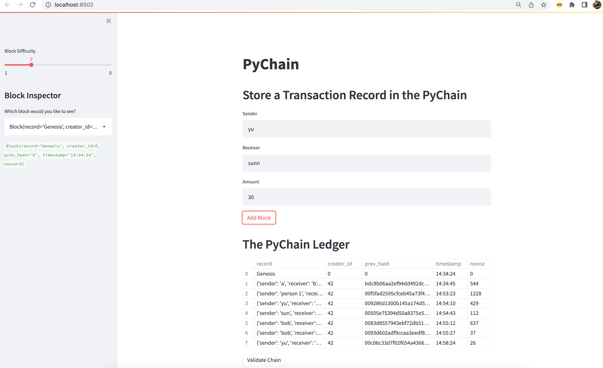
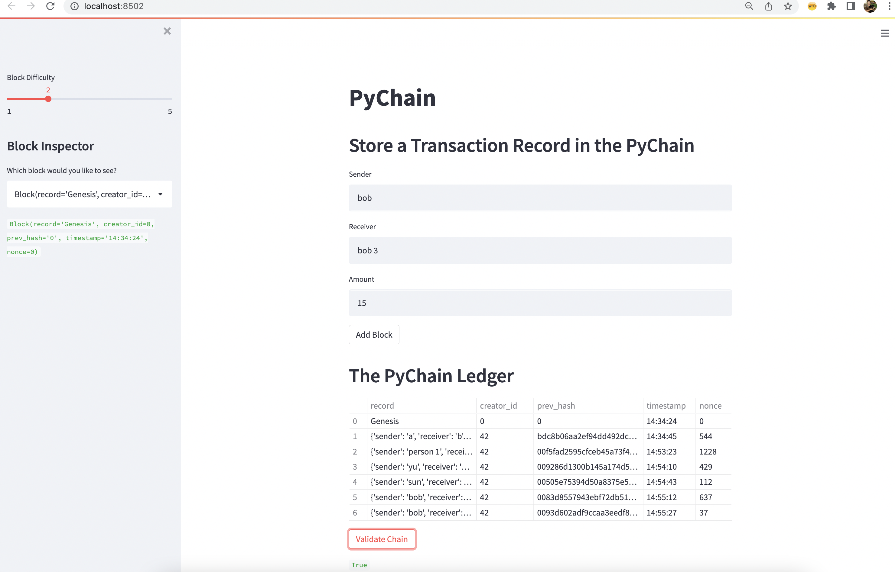

# Blockchain_Python

### This project aims to build a blockchain-based ledger system that is complete with a user-friendly web interface. This ledger allows others to conduct financial transactions (i.e., to transfer money between senders and receivers) and to verify the integrity of the data in the ledger.

---

## Technologies

This project leverages python 3.9 and VS code was used to run all analysis.

---

## Installations

Before running the application first import the following libraries and dependencies.

```python
import streamlit as st
from dataclasses import dataclass
from typing import Any, List
import datetime as datetime
import pandas as pd
import hashlib

```

---

## Creating and Using the Ledger

A new class named `Record` was defined to include the `sender`, `receiver`, and `amount` attributes so their information can be captured and recorded.

This ledger runs on [Streamlit](https://docs.streamlit.io/library/get-started), which is a Python library that can turn Python scripts into user friendly, shareable web apps.

To do so, use the following codes:

```python
streamlit run pychain.py
```

Below are screenshots of the running application and validation:




